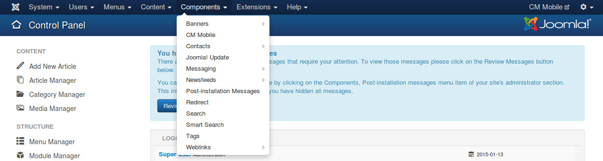
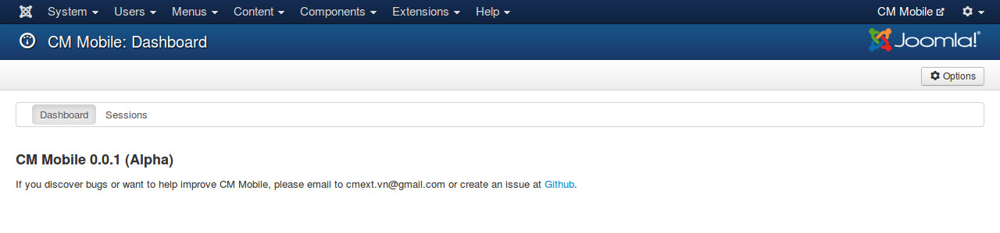
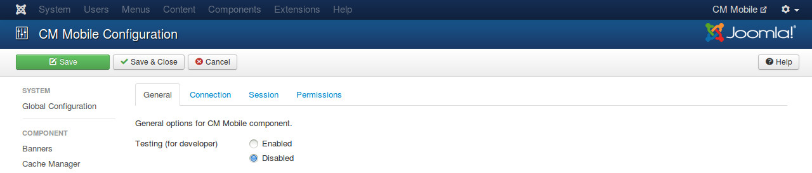
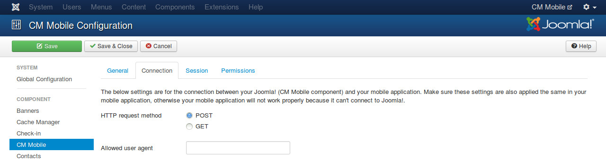
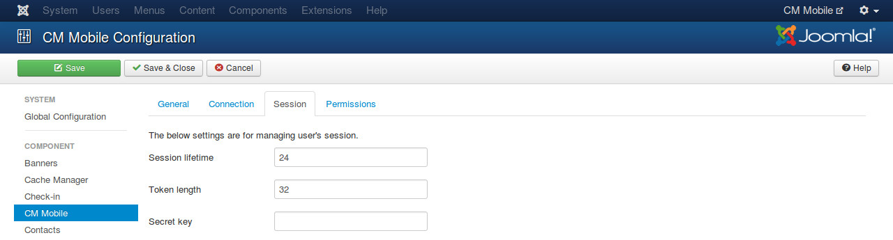

=============
Configuration
=============

In your Joomla!'s back-end, you go to Components -> CM Mobile to access CM Mobile component.

The default page of CM Mobile is the dashboard. On the toolbar there is an "Options" button, you click this button to configure the component.

There are the 4 tabs in the configuration page: General, Connection, Session, Permissions.

General
^^^^^^^

* **Testing (for developer)**: If testing is enabled, HTTP user agent and session's checksum are not checked. Developer can request JSON response right from web browser. Session's token is still required. You should disable testing if your application and website are in production.

Connection
^^^^^^^^^^

"Connection" tab includes the setting options for the connection between CM Mobile and your mobile application. The settings you apply here need to be applied the same in your mobile applicaton, otherwise CM Mobile will not respond to the requests of your mobile application.

* **HTTP request method**: The HTTP request method which is used in connection.
* **Allowed user agent**: Enter the string of your custom user agent. Only the requests which comes with this user agent are handled, the requests come with any other user agents will be ignored. This option gives another filter layer to make sure only your mobile application can connect to the component. You can find ideas for your custom user again at many websites, for example `http://www.user-agents.org/ <http://www.user-agents.org/>`_.

Session
^^^^^^^

* **Session lifetime**: Session lifetime in hour. Default is 24 hours. If session's token is older than session's lifetime, session must be cleared and user must login to create a new session.
* **Token length**: The length of token, default is 32 characters, 200 characters maximum. Token is a string which contains alphabetic and numeric characters characters, it is used to identity user's session.
* **Secret key**: The string which is used in create and validate checksum. Checksum is sent in every request from mobile application to Joomla! to make sure that the request is come from your mobile application.

Permissions
^^^^^^^^^^^

"Permissions" tab contains the permission settings for user groups on your site, you can see this in all Joomla!'s default components, as well as other third-party components.

Because CM Mobile only has user interface in back-end so you may only need to adjust these settings if you allow other users to access your site's back-end and you want to limit what they can do.