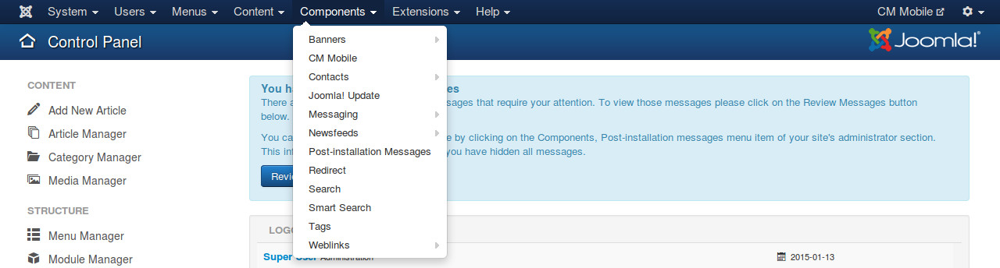

============
Installation
============

Download
--------

The installation packages of CM Mobile can be downloaded from `our Github repository <https://github.com/cmextension/cmmobile/releases>`_.

Installation
------------

In your Joomla! back-end, you navigate to Extensions -> Extension Manager

Click "Browse" button and select the installation package of CM Mobile on your computer, click "Upload & Install" button to upload the package to your server and install it.

If the package is installed successfully, you receive the message "Installing package was successful."

You can see CM Mobile in Components menu item.

