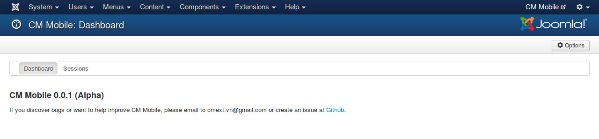

========
Sessions
========

In CM Mobile's dashboard, you click "Sessions" item in the component's toolbar to access the list of sessions.

In this page you can see the list of created sessions, session is created when your user logs into from the mobile application.

Expired sessions have expired date in red color.

You can select sessions and click "Detele" button to delete them. You can also click "Delete expired sessions" to delete only expired sessions without manually selecting them.

You often don't need to check and delete expired sessions when your site and your application are in production, however when they are in development you may need to delete sessions for testing purposes.
